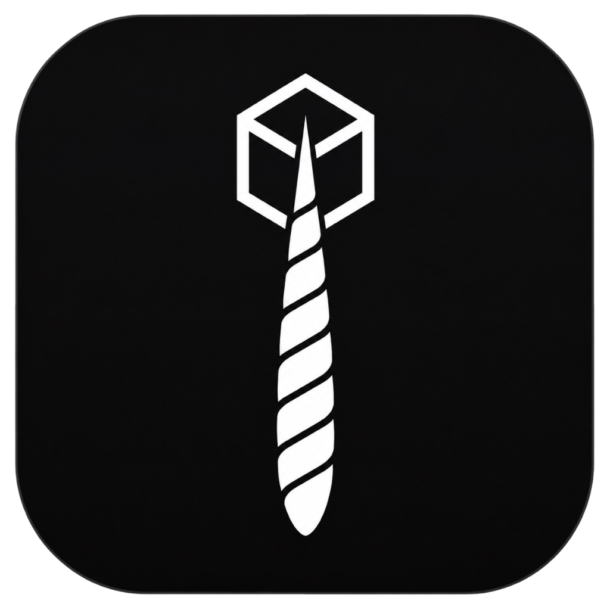
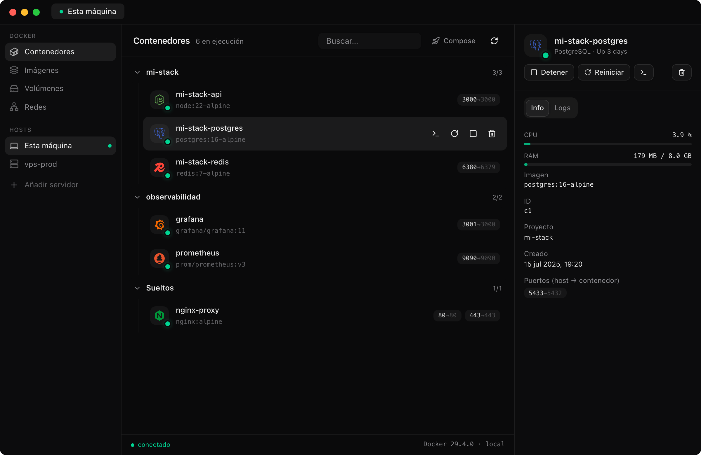

<div align="center">
  
  <h1>Narwhal</h1>
  <p><strong>Gestor de Docker de escritorio, local y remoto.</strong></p>
  <p><em>El unicornio del mar que navega entre tus contenedores.</em></p>
  <p>
    
    
    
  </p>
  <p><a href="https://chefibecerra.github.io/narwhal/"><strong>chefibecerra.github.io/narwhal</strong></a></p>
</div>

---

<div align="center">
  
</div>

Narwhal es un gestor de Docker de escritorio para macOS, Windows y Linux. La misma
interfaz para el Docker de tu máquina y el de cualquier servidor por SSH — **sin
instalar agentes, sin abrir puertos, sin paneles web pesados**. Como OrbStack, pero
multiplataforma y con tus VPS dentro.

## Características

- **Local y remoto, misma app** — el Docker de tu máquina (Docker Desktop, OrbStack,
  Colima…) y tus servidores por SSH. Cambiar de host es un clic; todo funciona igual.
- **Cero agentes, cero puertos** — el socket de Docker del servidor viaja por un túnel
  SSH cifrado (el equivalente a `ssh -L`, automático). El servidor solo necesita Docker.
- **Agrupado por proyecto Compose** — contenedores organizados como tú piensas, con el
  icono de cada servicio: Postgres, Redis, Nginx, Grafana… y acciones de grupo
  (`stop`, `restart`, `down`).
- **Despliega un Compose pegándolo** — pega tu `docker-compose.yml`, dale nombre y
  míralo levantarse con la salida en vivo. Se guarda en tu biblioteca para re-desplegar.
- **Consola dentro del contenedor** — terminal real (xterm) vía Docker API: bash o sh,
  colores, resize. Idéntica contra servidores remotos, a través del túnel.
- **Logs y stats en vivo** — streaming con búsqueda, CPU y RAM por contenedor, y badges
  de healthcheck que avisan cuando algo lleva días `unhealthy`.
- **Imágenes, volúmenes y redes** — las cuatro vistas completas, con limpieza guiada
  (`prune`) que dice cuánto espacio liberaste.
- **Barra de menú de macOS** — tus proyectos y su estado sin abrir la ventana, con
  acciones rápidas por contenedor.
- **Paleta de comandos** (`⌘K`) — salta a cualquier contenedor, host o vista sin ratón.
- **Docker API nativa** — habla con el socket vía [`bollard`](https://github.com/fussybeaver/bollard)
  (Rust): sin parsear CLI, sin depender de la versión del cliente del servidor.
- **Claves SSH detectadas** — elige tu clave de `~/.ssh` de un desplegable o importa
  tus hosts desde `~/.ssh/config` en dos clics.
- **Actualizaciones automáticas** — firmadas criptográficamente, con aviso y confirmación.

## Instalación

Descarga desde la
[**página de releases**](https://github.com/chefibecerra/narwhal/releases/latest):

| Plataforma | Instalador | Portable (sin instalar) |
|-----------|-----------|--------------------------|
| macOS (Apple Silicon / Intel) | `.dmg` | `.app.tar.gz` |
| Windows | `.exe` o `.msi` | `_portable.exe` |
| Linux | `.deb` o `.rpm` | `.AppImage` |

Los **portables** se ejecutan sin instalación ni permisos de administrador (el `.exe`
de Windows solo necesita WebView2, incluido en Windows 10/11).

> **macOS**: las compilaciones aún no están firmadas con Apple. Si Gatekeeper se queja,
> ejecuta `xattr -cr /Applications/Narwhal.app` una vez tras instalar.

## Cómo funciona el modo remoto

```
┌─ Narwhal ─────────────────┐
│  UI · logs · stats · exec │
│      Docker API (Rust)    │
└─────┬──────────────┬──────┘
      │ socket local │ túnel SSH (russh)
┌─────▼─────┐  ┌─────▼──────────────────────┐
│ Docker de │  │ /var/run/docker.sock       │
│ tu máquina│  │ del servidor — sin agente  │
└───────────┘  └────────────────────────────┘
```

Narwhal reenvía el socket de Docker del servidor por un canal SSH
(`direct-streamlocal`) y habla la API nativa contra él. Por eso **todo** — consola,
stats, compose — funciona idéntico en local y en remoto: es un solo camino de datos.

## Seguridad

La regla de oro: **tus secretos no tocan el disco.**

- Los hosts se guardan **sin contraseñas**. Password o passphrase se piden al conectar
  y viven solo en memoria durante la sesión (como `ssh-agent`); al cerrar la app, se esfuman.
- **Verificación TOFU** como OpenSSH: la huella del servidor se registra en la primera
  conexión y se verifica en las siguientes. Si cambia, Narwhal corta y avisa de posible MITM.
- **Rust de punta a punta**: SSH con `russh`, Docker API con `bollard`, app nativa con
  Tauri 2. Sin Electron, sin telemetría, sin cuentas.

## Compilar desde el código

Requisitos: [Rust](https://rustup.rs), [Node.js](https://nodejs.org) 20+ y
[pnpm](https://pnpm.io), más las
[dependencias de sistema de Tauri](https://tauri.app/start/prerequisites/).

```bash
pnpm install
pnpm tauri dev      # desarrollo con hot-reload
pnpm tauri build    # instalador de producción
```

## Hoja de ruta

- [ ] Vault cifrado para guardar contraseñas (mismo formato que Ratatoskr, importable)
- [ ] Stats de CPU/RAM en cada fila de la lista
- [ ] Ver y editar el YAML de proyectos Compose ya existentes
- [ ] Reconexión SSH automática con backoff
- [ ] Firma y notarización de Apple

---

<div align="center">
  <p>Proyecto hermano de <a href="https://github.com/chefibecerra/ratatoskr">Ratatoskr</a> 🐿️ — hecho con Rust, Tauri y respeto por tus servidores.</p>
</div>
